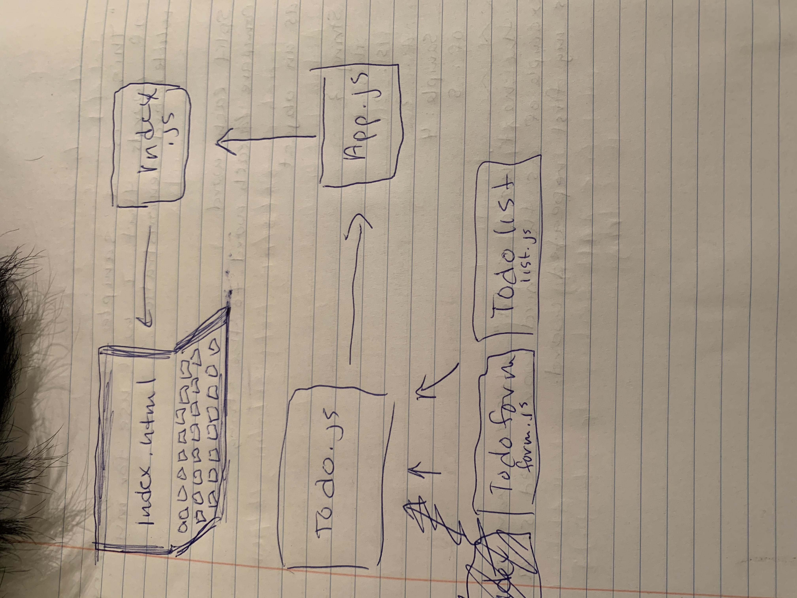

# TODO 

## Author: Sara Russert

## Description of Project
A Web Application for securely managing a To Do List

## Technical Requirements
React
ES6 Classes
Settings delivered to the application using Context
User Login & Permissions delivered to the application using Context
Local Storage / Cookies for storing login status
Local Storage / Cookies for storing user preferences
Superagent or Axios for performing API Requests
React Bootstrap for styling
Test Driven Development, using Jest
Tests will be runnable locally
Deployment to cloud provider

## Installing TODO
git clone https://github.com/401-advanced-javascript-sararussert/todo.git
navagate to the inner todo folder and npm i

## Using TODO
To use todo, follow these steps:
- you must have access to a local API server that can handle a route for todo on port 3001
- npm start
- npm test

## Acknowledgments 
for reference:
https://react-bootstrap.github.io/
https://reactjs.org/
Udemy- react course from Dr. Angela Yu
Pagination: https://www.digitalocean.com/community/tutorials/how-to-build-custom-pagination-with-react

# UML
